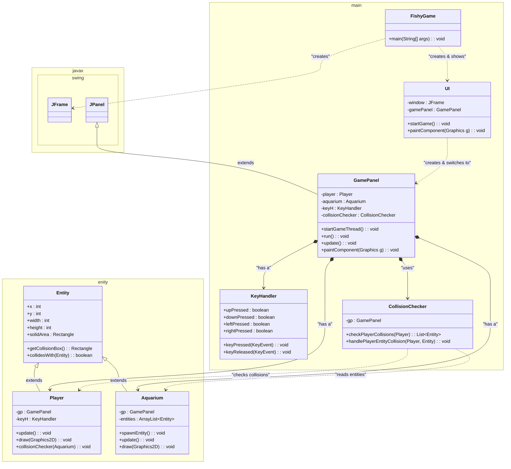

```mermaid
classDiagram
    %% Packages / namespaces
    namespace main {
        class FishyGame
        class UI
        class GamePanel
        class KeyHandler
        class CollisionChecker
    }
    namespace enity {
        class Entity
        class Player
        class Aquarium
    }
    namespace javax.swing {
        class JFrame
        class JPanel
    }

    %% Inheritance
    JPanel <|-- GamePanel : extends
    Entity <|-- Player : extends
    Entity <|-- Aquarium : extends

    %% Creation / usage
    FishyGame ..> JFrame : "creates"
    FishyGame ..> UI : "creates & shows"
    UI ..> GamePanel : "creates & switches to"
    GamePanel *--> Player : "has a"
    GamePanel *--> Aquarium : "has a"
    GamePanel *--> KeyHandler : "has a"
    GamePanel *--> CollisionChecker : "uses"

    CollisionChecker ..> Player : "checks collisions"
    CollisionChecker ..> Aquarium : "reads entities"

    %% Class details (key fields / methods)
    class FishyGame {
        +main(String[] args) : void
    }

    class UI {
        -window : JFrame
        -gamePanel : GamePanel
        +startGame() : void
        +paintComponent(Graphics g) : void
    }

    class GamePanel {
        -player : Player
        -aquarium : Aquarium
        -keyH : KeyHandler
        -collisionChecker : CollisionChecker
        +startGameThread() : void
        +run() : void
        +update() : void
        +paintComponent(Graphics g) : void
    }

    class KeyHandler {
        +upPressed : boolean
        +downPressed : boolean
        +leftPressed : boolean
        +rightPressed : boolean
        +keyPressed(KeyEvent) : void
        +keyReleased(KeyEvent) : void
    }

    class CollisionChecker {
        -gp : GamePanel
        +checkPlayerCollisions(Player) : List~Entity~
        +handlePlayerEntityCollision(Player, Entity) : void
    }

    class Entity {
        +x : int
        +y : int
        +width : int
        +height : int
        +solidArea : Rectangle
        +getCollisionBox() : Rectangle
        +collidesWith(Entity) : boolean
    }

    class Player {
        -gp : GamePanel
        -keyH : KeyHandler
        +update() : void
        +draw(Graphics2D) : void
        +collisionChecker(Aquarium) : void
    }

    class Aquarium {
        -gp : GamePanel
        -entities : ArrayList~Entity~
        +spawnEntity() : void
        +update() : void
        +draw(Graphics2D) : void
    }

    %% Notes
    %% Game flow: FishyGame -> UI -> GamePanel(loop) -> update/draw -> Player/Aquarium

```